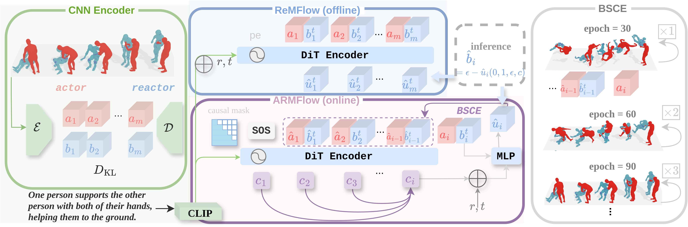

# ARMFLOW: AutoRegressive MeanFlow for online 3D Human Reaction Generation. 

<center>
CVPR 2026
</center>

---

**ARMFLOW** is a deep learning framework for modeling online/offline 3D Human Reaction Generation. It supports training and evaluation on both **InterHuman** and **InterX** datasets.

---




## 🧩 Project Structure

```bash
ARMFLOW/
├── cfg/              # Configuration files
├── ckpt/             # ckeckpoints
├── data/             # Dataset directory (containing interhuman/, interx/, and stats/ for interx)
├── datasets/         # Dataset loading and preprocessing scripts
├── deps/             # Dependencies, please create yourself
├── eval/             # evaluators
├── models/           # Model definitions
├── utils/            # Utility functions
├── train/            # Main training script
└── visualize/        # Visualization script
```
---
## ⚙️ Environment Setup

```bash
conda env create -f environment.yml
```
---

## 📦 Dataset Preparation
1. InterHuman

``` bash
# Step 1. Download the InterHuman dataset from:
# https://github.com/tr3e/InterGen

# Step 2. Organize the dataset as follows:
data/interhuman/
├── annotations_interhuman/
├── annots/
├── checkpoints/ # the feature extractor checkpoints. 
├── train.txt
├── test.txt
├── val.txt
├── motions/
├── motions_processed/
└── split/
```

2. InterX

``` bash
# Step 1. Download the InterX dataset from:
# https://liangxuy.github.io/inter-x/

# Step 2. Organize the dataset as follows:
data/interx/
├── annots/
├── misc/
├── text2motion/ # the feature extractor checkpoints. 
├── texts/
├── motions/
└── processed/
```
**Please put the stats folder into the data.**


## 🚀 Training

This section explains how to train the ARMFLOW model.

### 1. InterHuman

> CNN training

```bash
python -m train.klvae.train_klvae
```

> ARMFlow

```bash
python -m train.armflow.train_armflow \
mf.name=armflow_cfg18 \
mf.regen_ratio=1.0 \
mf.double_epoch=50 \
mf.replace_mask=True \
mf.siloss.cfg_omega=1.8 
```

> ReMFlow

```bash
python -m train.reactor.train_remf2 \
mf.name=remf2_dcond_cfg18 \
mf.is_dcond=True \
mf.siloss.cfg_omega=1.8
```


### 2. InterX


> CNN training

```bash
python -m train.klvae.train_klvaex
```

> ARMFlow

```bash
python -m train.armflow.train_armflowx \
mf.name=armflowx_cfg12 \
mf.regen_ratio=1.0 \
mf.double_epoch=30 \
mf.replace_mask=True \
mf.siloss.cfg_omega=1.2
```

> ReMFlow

```bash
python -m train.reactor.train_remf2x \
mf.name=remfx_dcond_cfg20 \
mf.is_dcond=True \
mf.siloss.cfg_omega=2.0
```


## 📝 TODO
- [x] Release the model.
- [x] Release implementation ode on InterHuman Dataset
- [x] Release the implementation on InterX dataset
- [ ] Release the weights on both datasets
- [ ] Release the Evaluation code
- [ ] Finalize the visualization scripts and dependencies. 